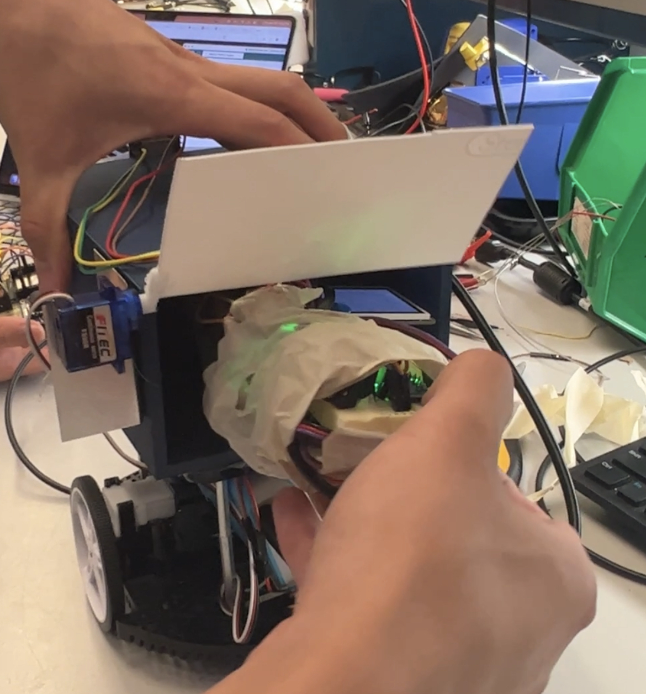

Team Name: MEDEPLOY

Team Members: Aaron Tsui, Dailing Wu, Ryan He

Github Repository URL: [https://github.com/ese3500/MEDEPLOY](https://github.com/ese3500/MEDEPLOY)

Github Pages Website URL: [https://ese3500.github.io/MEDEPLOY](https://ese3500.github.io/MEDEPLOY)

Description of hardware: 3 ATMEGA328PB's, 3 ESP32 Feathers, 1 ESP32 CAM, UPenn ESE department Halbot, L293D Motor Driver, ST7735R controller. See Hardware Requirements Specification for more details. 

## Final Project Proposal

### 1. Abstract

Our final project, called Medeploy, is a two-part device, consisting of a microcontroller controlled rover/RC-car for transportation, and a payload, which itself consists of a microcontroller that is responsible for communicating with the patient and obtaining critical medical data through various sensors. The vehicle is remotely operated with a joystick through a live video-feed and once it reaches the patient, the payload can be deployed for use. With this project, we hope to devise a viable solution for medical aid to be delivered to those in dangerous places.

### 2. Motivation

The problem that we want to solve is with delivering medical supplies and medical aid to people in hard-to-reach situations. These situations can include natural disasters, war/military zones, as well as biologically dangerous scenarios. Our approach for this is two fold: a remote controlled vehicle that allows the operator to safely deliver the payload to the subject, and the payload itself. The payload includes medical supplies as well as another embedded device with a multitude of sensors, such as a heart rate sensor to get vitals, and an LCD screen configured with buttons and a knob for the subject to communicate and answer critical questions to aid in their medical help. Overall, this project aims to reduce the risk in providing medical aid in dangerous situations, while also maximizing the amount of help that can be provided to those in need.

### 3. Goals

Vehicle:
* Blynk control with ESP32 Feather
* RC car with PWM motor control via ATmega328pb
* ESP32 Cam live video for remote operation
* Payload bay with unlocking door and remote/wireless unlocking mechanism (micro servo)

Payload:
* Heart Rate Sensor
* Interactive Device (LCD Screen + buttons)
* Other medical supplies

### 4. Software Requirements Specification (SRS)

Overview:

The software utilized in our project will primarily consist of two way wireless control between the controller and car. We will need to configure a Blynk interface to send forward or reverse commands wirelessly. These commands will be converted to PWM signals to throttle the motors. Additionally, a camera will be set up to continuously send back video via Blynk to our computer for driver perception. In the payload, the interactive LCD screen and heart sensor will have to interface with the Atmega and ESP32 to send their data back to the driver through Blynk as well.

Users:

The users for our project are medical personnel or any first responder that wishes to approach a scene remotely.

Definitions, Abbreviations:

* ESP32CAM
* Car ESP32
* Car AtMega
* Device ESP32
* Device AtMega

* (Optional) Joystick ESP32
* (Optional) Joystick AtMega

Functionality:

SRS 01 – Car ESP32 shall read 4 different push button states from Blynk over wifi using Arduino as we did in Pong. It shall check for forward, reverse buttons and turn left, right buttons at every tick. As long as these buttons are pressed, it shall pull a corresponding pin high on the AtMega for motor control.

SRS 02 – Car AtMega shall read the 4 pins and determine what direction the car is moving. Steering is done by spinning one wheel faster than the other. Therefore, the AtMega shall calculate the duty cycles of the left and right motors by setting OCR1B of Timer1 in Phase Correct PWM Mode. 75% duty cycle is full throttle and a difference of 50% duty cycle between each wheel will allow for steering.

SRS 03 – Device ESP32 shall send and receive data. Using the same Blynk protocol, the ESP32 receives data from two buttons under the LCD screen, corresponding to yes or no answers to prompts. A yes is 1 and a no is 0. The ESP32 will send this data to the driver’s computer. Answers will be displayed on the computer screen in real time.

SRS 04 – Device AtMega shall cycle through a prepared series of diagnostic questions for the victim. It will read the button presses and only advance to the next question once the current question is answered. It should also have an internal timer that sends an alarm if the victim is unresponsive.

SRS 05 – ESP32CAM shall implement Arduino code to wirelessly connect back to a computer in front of the driver for a live video feed.

### 5. Hardware Requirements Specification (HRS)

Overview:

The hardware for our project will be split distinctly between 2 different devices: the RC car and the medical device. If time allows, we will have a 3rd device (Joystick). For the medical device, the hardware will include an Atmega controller, an ESP32 device, as well as a screen to display information for the user. In addition, sensors for heart rate and other peripheral devices will be connected to the microcontrollers. The RC car has an Atmega and an ESP32 Feather for wireless PWM motor control, as well as an ESP32 Cam for wireless live video.

Definitions, Abbreviations:

* ESP32CAM
* (Optional) Joystick ESP32
* (Optional) Joystick AtMega
* Car ESP32
* Car AtMega
* Device ESP32
* Device AtMega

Functionality:

HRS 01 - The medical device shall be based/run on an ATmega328PB.

HRS 02 -  An adafruit heartrate sensor shall take pulse measurements. 

HRS 03 - Buttons shall be attached to the ATmega so that the user can interface with it. 

HRS 04 - A 1.8” 128x160 TFT LCD from Adafruit shall be controlled using the ST7735R controller through SPI. 

HRS 05 - There shall be an onboard ESP32 so that information can be transferred to and from the device to the car and medical personnel

HRS 06 - The car shall be based/run on an ATmega328PB.

HRS 07 - The car motors shall be controlled using PWM from the ATmega, through an LN293 h-bridge IC

HRS 08 - The car shall have another ESP32 that will receive signals from the ATmega328PB

### 6. MVP Demo

By the first milestone, we expect to make good progress on both parts of our project. If we were to not use an off-the-shelf car, such as ones provided in Detkin, we would expect that the construction of the vehicle would take us past the first milestone. Regardless, we expect to get the live remote video streaming working and if we were to use an off-the-shelf car we would also expect that entire part of the project to be completed as well. As for the deployable device, we expect to have basic functionality such as being able to simply obtain sensor data and the basic programming of the LCD screen/buttons.

### 7. Final Demo

After milestone 1, we hope to get the RC car fully functional and have the mechanisms to transport and deliver the payload device, which can be done through mechanical design of a compartment with micro servo motor control. Then, by the final demonstration, we expect that we have also finished the communication between the patient with the device and the remote operator, such as communicating wirelessly (e.g. Blynk) via the LCD screen and buttons. In the end, we should have a fully functioning remote control vehicle, capable of streaming video to the operator, and capable of transporting and delivering the payload device. The payload device will be capable of obtaining sensor data and user inputs and communicating that wirelessly to the operator.

### 8. Methodology

Because we are a team of 3 and our project essentially consists of two devices, we organized our methodology around the two separate devices. In the beginning, we expect that most of the work and our issues will be regarding the vehicle and getting that operational with wireless PWM control, in addition to the wireless live video. Hence, we will have two people on this in the beginning, one focusing on the video, the other on wireless control, and both working on the code. Our third member will begin on the second device (payload) in the meantime. Then, once the vehicle is implemented, we will shift our focus on the payload device and the controller. As for the controller, our main goal is to use ESP32 wireless control via Blynk, but if time allows, we also hope to experiment with two-way ESP32 communication to use a wireless joystick to control the vehicle. For the final demo, we will work to integrate the two parts together and all work together to fix any issues on either end. In the end, we hope to create a “mock-scenario” that demonstrates the environment, situation, problem, and how Medeploy addresses it.

### 9. Components

Vehicle:

* 1x ATmega328pb: to output PWM signals to power the vehicle’s motors
* 1x PWM controlled RC car: for the actual transportation
* 1x ESP32 Feather: to wirelessly control the vehicle via Blynk app
* 2x Battery/power management: one to power the esp32 and the other to power the ATmega328pb
* 1x ESP32 Cam module (w/ FTDI USB to TTL Serial Converter): for wireless live video

Payload Device (will also deliver supplies such as bandaids, gauze, medicine, etc):

* 1x ATmega328pb: responsible for powering and controlling the sensors, 
* 1x ESP32 Feather: configured with the Blynk app to receive inputs from user
* 2x Battery/power management: one to power the esp32 and the other to power the ATmega328pb
* 1x LCD Screen: To communicate with the patient/send messages/ask questions
* 1x Heart Rate Sensor: obtain heart rate
* 2x Push-buttons: allow for the user to give responses to yes/no questions asked by the remote operator on the LCD screen

### 10. Evaluation

Vehicle and Vehicle Control:

* We will implement obstacles for the vehicle to move around, which will allow us to rigorously test how well the vehicle can turn based on our Blynk controls
* We will also time the speed of the vehicle and how well it can stop via a testing track
* We will test the control via video through the aforementioned obstacles and tracks as well
* We will obtain feedback from TAs and classmates on our live video, allowing them to try controlling the vehicle via the live video interface

Payload Device:

* Allow TAs or classmates to interact with the LCD-display communication via buttons, to see if there are any bottlenecks in the workflow or any user-issues
* Test the heart-rate sensor through other heart-rate devices (i.e. smartwatch) to get accuracy

### 11. Timeline

This section is to help guide your progress over the next few weeks. Feel free to adjust and edit the table below to something that would be useful to you. Really think about what you want to accomplish by the first milestone.

For Milestone/Check-in:

* Aaron: setup remote live video with ESP32 cam, work on code for vehicle motor control
* Dailing: setup ESP32 feather for vehicle control, work on code for vehicle motor control
* Ryan: setup payload device wiring and start programming/testing it independently
* Together: find all the necessary parts to order, and order/get parts

For MVP Demo:

* Aaron: have live video feed with ESP32 cam working, wireless (Blynk) motor control done, work with Ryan to help with payload device
* Dailing: wireless (Blynk) motor control done, setup mechanical design and basic servo motor for payload drop 
* Ryan: LCD screen communication (via Blynk and buttons), sensor communication (via Blynk)

For Final Demo:

* Together: everyone works on integrating the vehicle with the payload seamlessly, helping out with each part together as well.

### 12. Proposal Presentation

Added to Final Project Proposal Slide Deck.

## Final Project Report

[Final Project Github Page](https://ese3500.github.io/MEDEPLOY)

### 1. Video

<video src="Demo Video.mov" width="400" height="300" controls></video>

[High Quality Video](https://drive.google.com/file/d/1yMe_-LCpSN9gtZ2RiFGLqDbZkPeV5HWe/view?usp=sharing)

### 2. Images

#### Car 

#### Wireless Camera

#### Wireless Camera Video Output

#### Joystick 

#### Driving 

#### Deploying Device 

#### Using Device 

### 3. Results

What were your results? Namely, what was the final solution/design to your problem?

The controller, car, and device all have an AtMega and ESP32.

Our final controller design did not utilize Blynk. We instead chose to incorporate manual controls for a more reliable, physical interface on the controller. We used one button to open and close the door on the back of the car. An LED was tied to the button such that it would light when the door opened and turn off when the door closed. Driving was done through a joystick connected to the AtMega using ADC. We programmed 4 directions of travel: forward, backwards, left, and right when the joystick is pushed all the way in the up, down, left, right positions respectively. Direction data is sent through 3 bits, where 101 is forward, 010 is backward, 110 is left, 101 is right.

The ESP32s communicate using the ESPNOW protocol, which connects multiple ESP32s by using their MAC addresses instead of Wifi. The car’s ESP32 receives the direction data through a packet and conditions on the 3 bits in the AtMega to determine what motor controls need to be sent out. These motor controls would go through an L293D H-bridge motor control IC, which took a 5V VCC from the AtMega. The outputs from the L293D drove the two motors on the car. We did not use AtMega PWM for motor control. The ESP32CAM mounted on the front of the car did not use ESPNOW, however. It required Wifi to be able to send a livestream from the car, and this was displayed on a laptop using the camera’s IP address. An on board battery pack powered the AtMega, ESP32, and ESP32CAM.

The device’s design remained the same as described in our proposal. Two buttons would allow the user to select answers to questions displayed on the LCD screen. We had two questions: one asking about the victim’s pain level and one asking about how urgently they need help. The questions are answered on a scale from 1 to 5. One button cycles through the 5 levels, and the other button selects. After the two questions are answered, the user holds the heart rate sensor on the device to get a heart reading. The analog heart reading is processed in the AtMega where it finds the average time between peaks to determine BPM. This gives an integer and is sent to the ESP32 through 3 pins by bit banging. Therefore, we needed to sync the clock cycles of the AtMega and ESP32. These values are stored in a packet and sent to the controller which prints the data out in Serial Monitor.

#### 3.1 Software Requirements Specification (SRS) Results

Based on your quantified system performance, comment on how you achieved or fell short of your expected software requirements. You should be quantifying this, using measurement tools to collect data.

#### 3.2 Hardware Requirements Specification (HRS) Results

Based on your quantified system performance, comment on how you achieved or fell short of your expected hardware requirements. You should be quantifying this, using measurement tools to collect data.

### 4. Conclusion

Reflect on your project. Some questions to consider: What did you learn from it? What went well? What accomplishments are you proud of? What did you learn/gain from this experience? Did you have to change your approach? What could have been done differently? Did you encounter obstacles that you didn’t anticipate? What could be a next step for this project?

## References

Fill in your references here as you work on your proposal and final submission. Describe any libraries used here.
